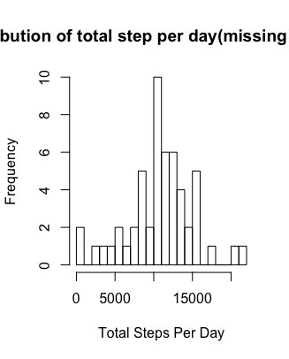
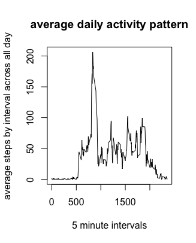
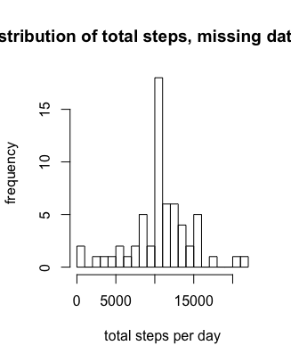
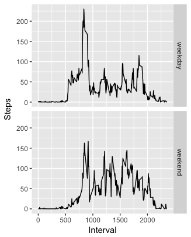

#Loading and preprocessing the data
#### Loading
```{r, echo=TRUE}
  setwd('/Users/ohjimin/Documents/R study')
  data<-read.csv('activity.csv')
```
#### Preprocessing 
```{r, echo=TRUE}
  library(ggplot2)
  library(dplyr)
  head(data)
  str(data)
  summary(data)
  data$date <- as.Date(data$date)
```
# What is mean total number of steps taken per day?
#### Calculate the total number of steps taken per day 
```{r, echo=TRUE}
  total_step <- tapply(data$steps, data$date, sum, na.rm=FALSE)
```
#### Make histogram of total number of steps taken each day
```{r, echo=TRUE}
  hist(x=total_step,breaks=20,xlab="Total Steps Per Day", ylab="Frequency", main="The distribution of total step per day(missing data ignored)")
```




#### Calculate and report the mean and median of the total number of steps taken per day.
```{r, echo=TRUE}
  total_step_na <- total_step[!is.na(total_step)]
    mean(total_step_na)
    median(total_step_na)
```

# What is the average daily activity pattern?
#### Activity pattern 
```{r, echo=TRUE}
  interval_avg <- tapply(data$steps, data$interval, mean, na.rm=TRUE)
  interval_int <- data.frame(interval=as.integer(names(interval_avg)), avg=interval_avg)
  with(interval_int, plot(interval, avg,type="l", xlab="5 minute intervals", ylab="average steps by interval across all day", main="average daily activity pattern"))
```



#### Maximum number of steps
```{r, echo=TRUE}
  max <- max(interval_int$avg)
  interval_int[interval_int$avg== max,]
```
# Imputing missing values
#### Calculate and report the total number of missing values in the dataset
```{r, echo=TRUE}
  sum(is.na(data$steps))
```
It is 2304 NAs  

#### Devise a strategy for filling in all of the missing values in the dataset.
Here, I will devise the strategy for filling in all the missing values into average of 5 minute interval.
#### Create a new dataset that is equal to the original dataset but with the missing data filled in.
```{r, echo=TRUE}
  data_impute <- data
  nano<- is.na(data_impute$steps)
  interval_avg <- tapply(data$steps, data$interval, mean, na.rm=TRUE)
  data_impute$steps[nano] <- interval_avg[as.character(data_impute$interval[nano])]
```
#### Make a histogram of the total number of steps taken each day and Calculate and report the mean and median total number of steps taken per day. 
```{r, echo=TRUE}
  new_total <- tapply(data_impute$steps, data_impute$date, sum, na.rm=TRUE)
  hist(x=new_total, breaks=20, xlab="total steps per day", ylab="frequency", main="the distribution of total steps, missing data imputed")
```



#### mean and median
```{r, echo=TRUE}
  mean(new_total)
  median(new_total)
```
# Are there differences in activity patterns between weekdays and weekends?
#### Create a new factor variable in the dataset with two levels; weekday, weekend. It is indicating whether a given date is a weekday or weekend day.
```{r, echo=TRUE}
  data_impute$date <- as.Date(data_impute$date)
  weekday <- ifelse(weekdays(data_impute$date) %in% c("Saturday", "Sunday"), "weekend", "weekday")
  weekday <- as.factor(weekday)
  data_impute$weekday <- weekday
```
#### Make a panel plot containing a time series plot of the 5-minute interval and the average number of steps taken, averaged across all weekday days or weekend days.
```{r, echo=TRUE}
  average_weekday <- group_by(data_impute,weekday,interval) %>% summarise(average_steps=mean(steps))
  g <- ggplot(average_weekday, aes(x=interval, y=average_steps)) + geom_line() + facet_grid(weekday~.) + labs(x="Interval") + labs(y="Steps")
  g
```

